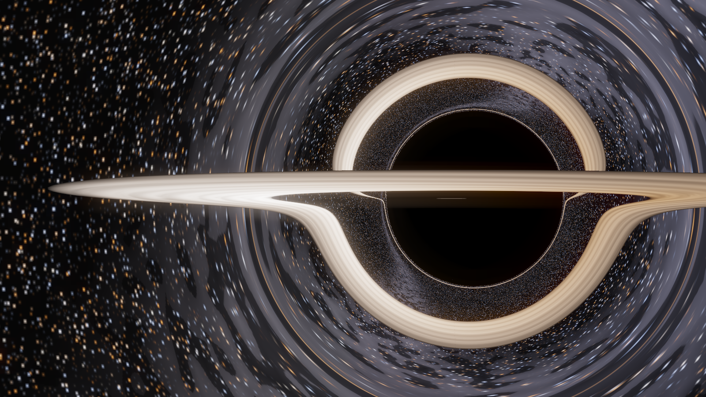

# imax

A from-scratch **Double Negative Gravitational Renderer**: a general-relativistic
ray tracer for a spinning (Kerr) black hole and its accretion disc, following

> O. James, E. von Tunzelmann, P. Franklin & K. S. Thorne,
> *"Gravitational Lensing by Spinning Black Holes in Astrophysics, and in the
> Movie Interstellar"*, Class. Quantum Grav. **32** (2015) 065001
> ([arXiv:1502.03808](https://arxiv.org/abs/1502.03808))

as closely as is practical in a single GPU kernel. The output is a 720p
ray-traced fly-around of Gargantua.



## what follows the paper

Every equation number below is from Appendix A of the paper.

| paper | here |
|---|---|
| Kerr metric, Boyer-Lindquist, `M = 1` (A.1, A.2) | `metric_factors` |
| FIDO orthonormal frame (A.3) | folded into the initial-ray + shading maths |
| ray constants `P, R, Θ`, trapped-orbit `b₀, q₀` (A.4–A.6) | `_K` |
| camera → local sky: `N` (A.8), relativistic aberration (A.9), projection onto the FIDO spherical basis via the motion vector `B` (A.10) | `initial_ray`, `camera_frame_N` |
| canonical momenta `pᵣ, p_θ` and constants `b, q` (A.11, A.12) | `initial_ray` |
| super-Hamiltonian null-geodesic equations (A.15) | `geodesic_rhs` (r/θ/b derivatives by exact autodiff) |
| backward integration with adaptive Runge–Kutta–Fehlberg (A.15 note, A.4) | `_rkf_step` + `trace_ray` (Cash–Karp 5(4), per-ray adaptive step) |
| circular equatorial geodesic camera orbit (A.7) | `orbit_params` (camera lifted `--incl-deg` off the plane so no pixel ray is a degenerate equatorial geodesic) |
| infinitely-thin planar accretion disc (A.6, Sec 4.3.2) | equatorial-plane crossing test in `trace_ray` |
| constant-temperature `T = 4500 K` black-body disc (Sec 4) | `shade`, `--disk-temp` |
| Doppler + gravitational frequency shift, brightness by Liouville `I_ν/ν³ = const` (Sec 4.1.2, A.6) | `shade` (`g = ν_obs/ν_emit` from the 4-velocities) |
| "colour only" mode dividing by the luma mean (Fig 15b) | `--shifts color` |
| 6500 K camera white balance (A.6) | `shade` |
| veiling flare, the soft glow of IMAX lenses (Sec 4.2, 4.3.1) | `add_veiling_flare`, `--flare` |
| paint-swatch disc radii `r = 9.26M … 18.70M` (Fig 13) | default `--disk-in/--disk-out` |

## where it deviates (and why)

* **Anti-aliasing.** The paper propagates an elliptical *ray bundle* beside
  every central ray (Sachs / Pineault–Roeder optical-scalar equations
  A.17–A.30) purely to filter the image. We stochastically super-sample
  instead (`--ssaa`). The paper notes (Appendix A.7) that flat-space
  ray-differential methods are "mathematically equivalent", and GRay / most
  astrophysical codes also trace individual rays.
* **Disc texture.** Interstellar's disc was a painting by a DNeg artist; ours
  is procedural spiral turbulence over the same infinitely-thin planar model.
* **Celestial sphere.** A procedural star field + Milky Way band rather than
  the DNeg Tycho-2 catalogue.
* **Spin.** Default `a/M = 0.6`, the value Nolan & Franklin chose for the film
  so the disc would not look too lopsided (Sec 4.1.1); the physics works for
  any `|a| < 1` (`--spin`).

## files

| file | |
|---|---|
| `dngr.py` | the renderer — geodesic integrator, shading, frame assembly. Runs anywhere JAX runs. |
| `modal_render.py` | runs `dngr.py` on a Modal GPU and pulls back `gargantua.mp4` |

## run it

On a Modal GPU (recommended — the geodesic integration wants one):

```bash
cd imax
modal run modal_render.py                                    # 720p, 96 frames, A10G
modal run modal_render.py --frames 240 --ssaa 3 --gpu L4     # long, smooth
modal run modal_render.py --still 0 --width 1920 --height 1080  # one hero still
modal run modal_render.py --shifts none --flare 0            # flat-transport look (Fig 13)
modal run modal_render.py --spin 0.999                       # near-extremal Gargantua
```

Locally (slow on CPU, fine for a small still):

```bash
python dngr.py --still 0 --width 640 --height 360 --ssaa 1
```

## knobs

`--spin a/M` · `--radius` camera orbit radius / M · `--incl-deg` camera tilt
above the disc · `--fov-deg` · `--orbit-frac` fraction of a full revolution ·
`--disk-in/--disk-out/--disk-temp/--disk-gain` · `--shifts {none,color,full}` ·
`--star-shifts 0/1` · `--exposure` · `--flare` veiling-flare strength ·
`--ssaa` √(samples per pixel) · `--max-steps` integrator cap ·
`--frames/--fps` · `--still N` render one frame · `--dump-frames`.

## validation

`python dngr.py` reproduces, for a Schwarzschild hole (`--spin 0`) seen from
`r_c = 100M`, a shadow whose angular radius matches the analytic critical
impact parameter `b_c = √27 M` to within a couple of percent, and the
super-Hamiltonian `K` stays `≈ 0` (null) along every integrated ray.
